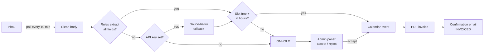

# Trinops Booking Pipeline

Email-to-booking automation for appointment-based businesses. Built as a client project, genericised for portfolio — all company-specific values live in `.env`.

## The problem

Appointment-based businesses waste hours every week on the same loop: read an enquiry email, work out what's being asked for, check the calendar, write a confirmation, raise an invoice. This pipeline does the whole loop automatically and only involves a human when something genuinely needs judgement.

## What it does

1. Polls the inbox every 10 minutes
2. Cleans the email body (HTML, URLs, signatures stripped)
3. Extracts booking fields with **rules first** (`dateparser` + regex) — no API cost for the majority of emails
4. Falls back to `claude-haiku-4-5-20251001` **only** when the rules can't fill every field (and only if an API key is configured)
5. Checks calendar availability for the requested slot
6. **Slot free:** creates the calendar event, generates a PDF invoice, emails the confirmation with the invoice attached
7. **Slot busy / extraction incomplete / out of hours:** booking goes **ONHOLD**, staff review it in the admin panel and accept (with corrections) or reject



## Quick start (demo mode — no credentials needed)

```bash
docker compose up --build
```

Open **http://localhost:8000**. On startup the pipeline processes six seed enquiry emails (`seed/emails.json`) and you'll see the full range of outcomes:

| Seed email | What happens | Why |
|---|---|---|
| Client X — consultation, next Tuesday 10am | INVOICED | Clean extraction, slot free |
| Client Y — installation, next Wednesday 1pm | ONHOLD | Demo calendar has a daily busy block 13:00–14:00 |
| Company A — maintenance, next Thursday 2:30pm | INVOICED | Clean extraction, slot free |
| Client Z — vague survey question | ONHOLD | No date/time to extract |
| Client W — consultation at 7pm | ONHOLD | Outside business hours (09:00–17:00) |
| Client V — HTML email, inspection tomorrow 9am | INVOICED | HTML cleaned, fields extracted |

In demo mode nothing leaves your machine:

- **Calendar** is simulated in memory (busy 13:00–14:00 daily)
- **Outgoing email** is written to `data/outbox/` as HTML files
- **Invoices** are real PDFs in `data/invoices/`

Try the review flow: open an ONHOLD booking in the admin panel, fill in the missing date/time in the drawer, and accept — it confirms, invoices, and writes the confirmation to the outbox.

## Running tests

```bash
docker compose run --rm app pytest
```

Or locally (WeasyPrint needs Pango — `brew install pango` on macOS):

```bash
python3 -m venv .venv && source .venv/bin/activate
pip install -r requirements.txt
pytest
```

## Configuration

Copy `.env.example` to `.env`. Every variable:

| Variable | Default | Purpose |
|---|---|---|
| `DEMO_MODE` | `true` | `true` = seed emails + fake calendar + outbox; `false` = real Gmail/Calendar |
| `DATABASE_URL` | `sqlite:///./data/bookings.db` | SQLAlchemy URL — PostgreSQL-ready |
| `POLL_INTERVAL_MINUTES` | `10` | Inbox polling cadence |
| `ANTHROPIC_API_KEY` | empty | Empty = LLM fallback disabled, unparseable emails go ONHOLD |
| `CLAUDE_MODEL` | `claude-haiku-4-5-20251001` | Cheapest Claude model — fallback only |
| `GOOGLE_CREDENTIALS_FILE` / `GOOGLE_TOKEN_FILE` | `credentials.json` / `token.json` | OAuth files for live mode |
| `GOOGLE_CALENDAR_ID` | `primary` | Calendar checked/written |
| `GMAIL_QUERY` | `is:unread label:bookings` | Which emails the poller picks up |
| `COMPANY_NAME` / `COMPANY_EMAIL` / `COMPANY_ADDRESS` | Company A placeholders | Appear on invoices and emails |
| `VAT_RATE` | `0.20` | Invoice VAT |
| `BUSINESS_START_HOUR` / `BUSINESS_END_HOUR` | `9` / `17` | Bookings outside go ONHOLD |
| `APPOINTMENT_DURATION_MINUTES` | `60` | Slot length |
| `SERVICE_PRICES` | consultation/installation/maintenance/inspection | JSON map of net prices |

## Live mode (real Gmail + Google Calendar)

1. Create a Google Cloud project, enable the **Gmail API** and **Calendar API**
2. Create OAuth client credentials (Desktop app), download as `credentials.json`
3. Run the standard Google OAuth flow once to produce `token.json` with scopes `gmail.modify`, `gmail.send`, `calendar`
4. Set `DEMO_MODE=false` and restart

## Project layout

```
booking_pipeline/
  email_ingestion.py   # Gmail polling / seed source, HTML cleaning
  extractor.py         # rules first, claude-haiku fallback only
  calendar_client.py   # availability check + event creation (demo / Google)
  invoice.py           # Jinja2 → WeasyPrint PDF
  notifier.py          # confirmation / ONHOLD emails (outbox / Gmail)
  pipeline.py          # orchestration + status transitions
  scheduler.py         # APScheduler poll job
  models.py            # SQLAlchemy 2.0: Booking, BookingStatus
  database.py
api/                   # FastAPI: GET /bookings, PATCH accept / reject
frontend/              # admin panel (vanilla HTML/CSS/JS)
templates/             # invoice + email Jinja2 templates
tests/                 # pytest: extractor, calendar, invoice
```

## Design notes

- **API cost is a design constraint.** Rule-based extraction handles standard enquiries for free; the Claude call is a last resort and uses the cheapest model. With no API key the system still works — edge cases just route to staff review.
- **Status flow** is a one-way street: `PENDING → ONHOLD | CONFIRMED → INVOICED`, with `REJECTED` from staff review. Every transition is logged.
- **Swappable integrations.** Email source, calendar, and notifier are protocols with demo + Google implementations, so the demo runs anywhere and the live wiring is a config flag.
